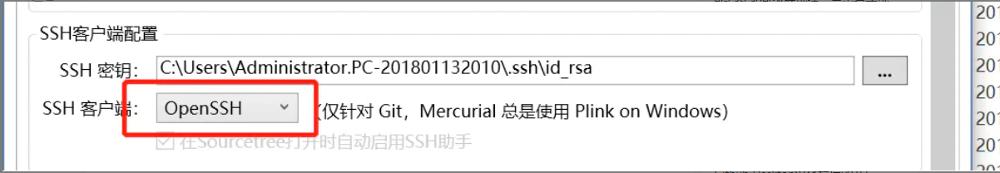

# Sourcetree使用ssh后出现 The server's host key is not cached in the registry


```
git -c diff.mnemonicprefix=false -c core.quotepath=false fetch origin
The server's host key is not cached in the registry. You
have no guarantee that the server is the computer you

think it is.
The server's rsa2 key fingerprint is:
ssh-rsa 2048 9f:a7:a4:00:e4:f1:7a:bc:aa:c1:d3:ea:1e:d7:4d:79
If you trust this host, enter "y" to add the key to
PuTTY's cache and carry on connecting.
If you want to carry on connecting just once, without
adding the key to the cache, enter "n".
If you do not trust this host, press Return to abandon the
connection.

链接：https://www.jianshu.com/p/610ee519ea78

```

出現這個問題是時候，


选择工具，然后点击选项。 最后更换一个`openSSH` . 就ok。




<hr>


